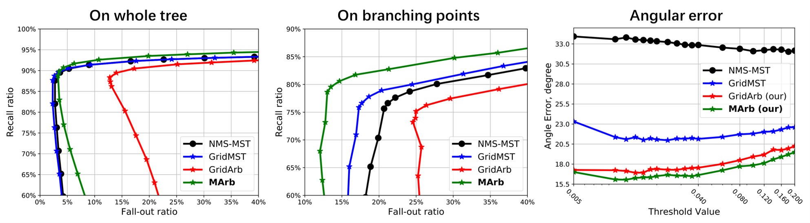

# data_and_evaluation

Code for generating the dataset and evaluation metrics discussed in [Confluent Vessel Trees with Accurate Bifurcations][paper] which will appear in CVPR2021. The implementation of the data generation was forked from https://github.com/midas-journal/midas-journal-794 and the original project description is at http://www.insight-journal.org/browse/publication/794.

[paper]:https://arxiv.org/abs/2103.14268

## Instructions for data generation

## Instructions for running the evaluation

### Python enviroment and dependencies

The script is tested under python 3.5.2. To install the dependencies, run
```
pip install -r requirements.txt
```

### How to use the code

To obtain the ROC and angular error curves, use the exmaple script [eval.sh](src_evaluation/eval.sh). The input will be the reconstructed tree in H5 format and groundtruth in XML format. The output will be the average measure over the 15 volumes and saved in a file named "***Average.csv". This file contains the following variables.

To generate the "On whole tree" ROC curve,
```
X-axis: 1 - PercentageOfPointsCloserThanRadius
Y-axis: PercentageOfPointsCloserThanRadiusOrig
```
To generate the "On branching points" ROC curve,
```
X-axis: 1 - PercentageOfBifurPointsCloserThanRadius
Y-axis: PercentageOfBifurPointsCloserThanRadiusOrig
```
To generate the angular error plot,
```
X-axis: ThresholdValue
Y-axis: averageAngleAtBifur
```

<span align="center"></span>
